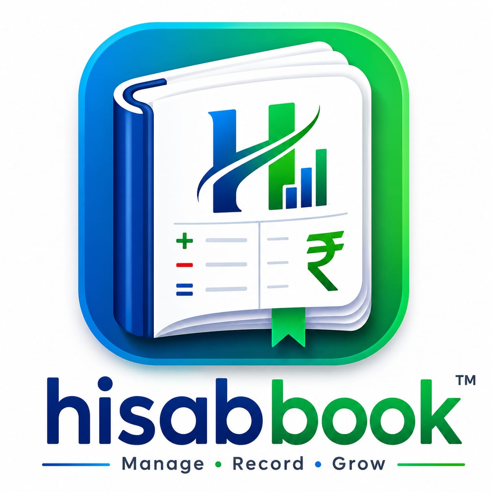

# 📒 HisabBook

  

<h2 align="center">💰 Smart Expense & Income Tracker</h2>

Manage your daily income, expenses, budgets, and financial reports with a clean, fast, and user-friendly interface.

---

## ✨ Features

- 💵 Track Income & Expenses
- 📊 Beautiful Analytics Dashboard
- 📈 Monthly Budget Management
- 🏷️ Category-wise Transactions
- 💳 Cash & Online Payment Tracking
- 🔍 Search & Filter Transactions
- 📂 Export CSV
- 📥 Import CSV
- 📄 Download Financial Reports (PDF)
- 🌍 Multiple Currency Support
- 🚀 Fast & Lightweight
- 🔒 Offline & Secure
- 🚫 Ad-Free Experience

---

## 📱 App Screenshots

  

## 🚀 Installation

1. Download the APK.
2. Install it on your Android device.
3. Allow **Install from Unknown Sources** if prompted.
4. Open **HisabBook** and start managing your finances.

---

## 📥 Download

### 👉 **[⬇ Download HisabBook APK]**

  

## 📌 Why HisabBook?

✔ Easy to Use

✔ Clean UI

✔ Smart Analytics

✔ Category-wise Reports

✔ Offline Support

✔ Secure Data

✔ No Advertisements

✔ Fast Performance

---

## 👨‍💻 Developer

**Dwarkesh Savaliya**

---

## ⭐ Support

If you like this project, don't forget to **⭐ Star** the repository and share it with your friends.

---

Made  by <b>Dwarkesh Savaliya</b>

